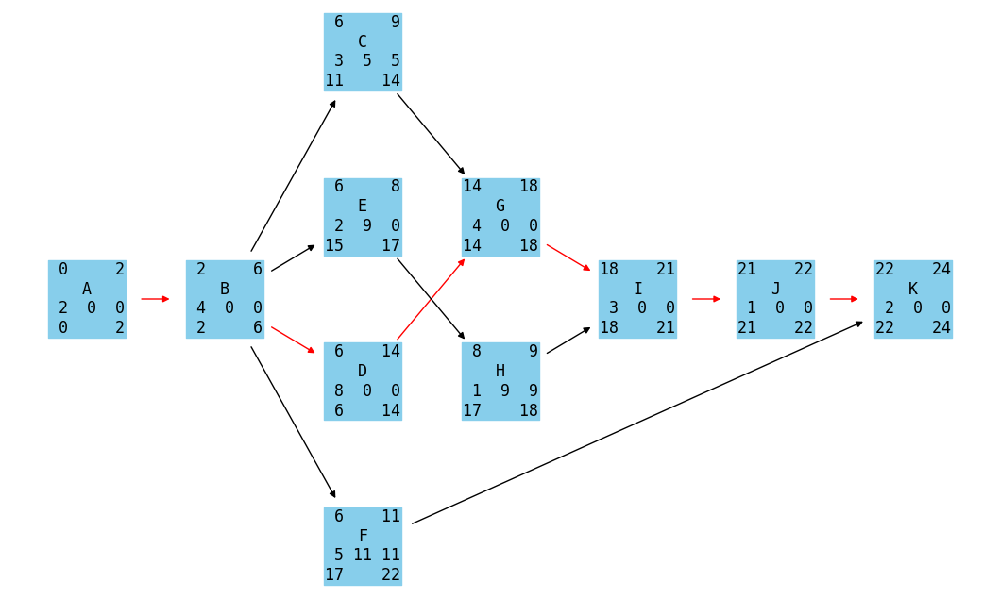

# A Simple Project Network Diagram Generator

This simple project network diagram generator calculates and displays network diagrams based on a given CSV file.

A fancier PND generator for Android and iOS can be found here: https://github.com/Mar1oSch/netzplaner

## Installation

### Dependencies
- python 3
- matplotlib
- networkx

```
pip install -r requirements.txt
```

## Usage

The program expects a CSV file consisting of 3 columns: name, duration, and a
comma separated list of predecessors. See the files under *examples*.

By default, the program assumes whitespace separated columns, but the delimiter
character can be defined via the `-d` option.

```
python nd.py -d ',' file.csv
```

## Example Output

Each node consists of 4 lines:
1. Early start time and early finish time
2. The name of the task
3. Duration, total float, and free float
4. Late start time, late finish time

The critical path is colored red.

